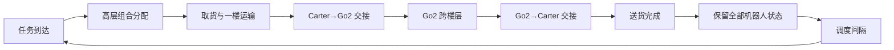

# 架构决策：异步连续任务与持久机器人状态

日期：2026-08-04  
状态：已确认，替代阶段 11–15 原“2–4 个任务并发执行”主线

## 决策

阶段 11 之后采用异步连续任务模式：同一时刻只执行一个主运输任务；当前任务
完成并经过可配置的调度间隔后，再下发下一任务。任务之间不重置机器人位置、
楼层、待命点、累计路程、累计任务数或最近工作负载。

并发任务、随机起点和动态障碍不再作为当前训练主线，保留为规则与强化学习稳定
之后的鲁棒性扩展。Gazebo 接触动力学仍在阶段 16 统一验收。

## 连续任务时序

任务间隔用于状态同步、指标记录和高层策略计算，不把机器人送回初始位，也不
清空跨任务统计。任务级清理只释放本任务货物和资源锁。

## 高层策略职责

每次任务到达时，规则调度器或强化学习策略选择一个合法组合：

1. 哪辆 Carter 前往货物起点取货；
2. 是否需要 Go2，以及选择哪只 Go2；
3. 跨层任务使用哪条楼梯；
4. 在哪个发送/接收交接点对接；
5. 由哪辆目标楼层 Carter 接货；
6. 送往哪个任务指定卸货平台；
7. 任务完成后原地等待、前往待命点或为下一任务预部署。

SCAN-Planner 继续负责从机器人当前实际位置到高层目标点的具体路径。高层策略
不得输出 `cmd_vel`、关节角或步态控制量。

## 状态与动作

决策观测至少包含：

- 10 台机器人的当前位置、楼层、可用性和故障状态；
- 当前是否携带货物、累计路程、累计任务数和最近空闲时间；
- 四只 Go2 当前所在楼层；
- 楼梯、交接区和区域资源状态；
- 当前任务起点、终点、优先级和期限；
- 上一任务结果和结束位置。

动作采用经规则掩码过滤的组合分配，不直接采用十个机器人各自随意行动。非法
组合（Carter 上楼、故障机器人接单、楼梯与 Go2 不匹配、接收车楼层错误等）
在执行前被屏蔽。

## 重置边界

- `task_reset`：清理已完成任务、货物和资源锁，保留机器人连续状态；
- `episode_reset`：一个 episode 包含 20–50 个连续异步任务，结束后才整体复位；
- 严重不可恢复故障可以提前结束 episode，但不能用逐任务复位掩盖调度问题。

## 规则与强化学习关系

规则调度器继续作为安全兜底、动作掩码来源和比较基线。强化学习优化长期任务
序列中的组合分配与预部署，目标是减少完成时间、空驶距离、交接等待和机器人
负载不均衡。若强化学习不能在相同任务序列和初始状态下超过规则基线，则不进入
部署主线。

## 修订后的阶段方向

- 阶段 11：异步连续规则调度与持久状态门禁；
- 阶段 12：事件驱动高层分配环境与组合动作掩码；
- 阶段 13：任务级/episode 级重置、长期奖励和终止条件；
- 阶段 14：从固定任务到连续任务序列的 MAPPO 课程训练；
- 阶段 15：规则与强化学习使用同任务序列、同初态的基线/消融/泛化对比；
- 阶段 16：RViz 完整演示、Gazebo 动力学与最终交付。

