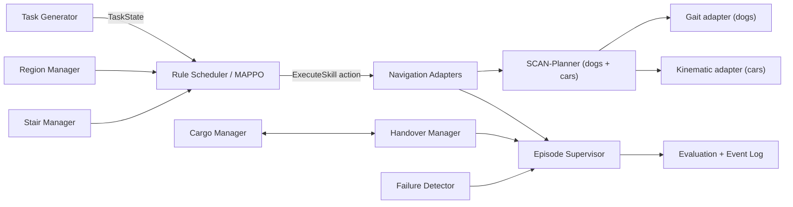
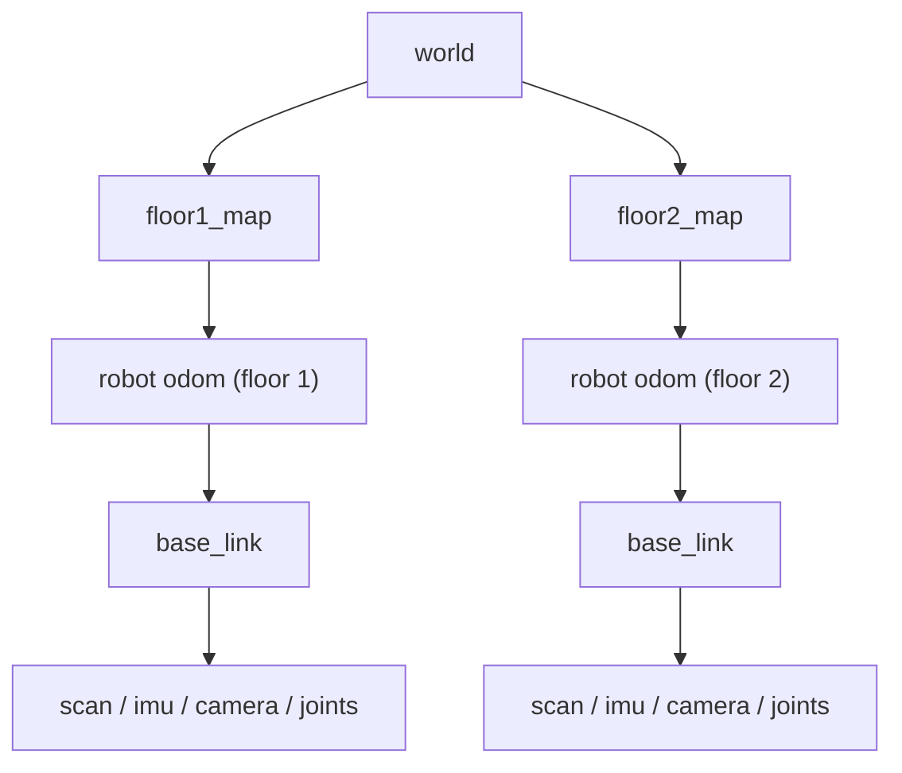

# 第一阶段设计基线

## 分层

场景环境层 → 机器人模型层 → 地图定位层 → 导航执行层 → 任务生成层 → 货物管理层 → 交接管理层 → 失败判定与恢复层 → 规则调度层 → 强化学习层 → 实验评估层。

连续控制边界（2026-08-02 修订）：Go2 与 Carter 统一由 SCAN-Planner 生成
三维路径；Go2 通过步态适配器执行，Carter 通过车辆运动学适配器执行。车辆路线
通过航点约束尽量保持类似二维导航的直线与正交走廊形态。规则或 MAPPO 只调用
`ExecuteSkill`，不直接输出关节控制或速度指令。原 Nav2+MPPI 车辆方案停止作为
主线，仅保留已有配置作为对照资产。

## 节点通信

主要状态话题为 `/warehouse/state/{robots,tasks,cargo,handovers,stairs,regions,episode}`；资源操作使用 `/warehouse/reservations/{reserve,release}`；技能执行使用每机器人 namespace 下的 `execute_skill` Action。诊断与完整事件统一写入 `/warehouse/events`。

## TF

车辆永不切换楼层地图。Go2 只在“已预约楼梯 → 进入楼梯 → 出口区域触发 → 姿态与定位稳定 → TF 有效”全部成立后切换 `current_floor`，禁止只用瞬时 z 值。

## 状态机

- 任务：`CREATED → RESERVED → ASSIGNED → PICKUP → TRANSPORT → HANDOVER* → DELIVER → COMPLETED`；任意执行态可进入 `RECOVERY → FAILED/前一安全态`。
- 货物：严格采用接口中的 13 个 `CargoPhase`，所有权始终为零或一。
- 交接：`PREPARE → RESERVE → APPROACH → ALIGN → TRANSFER → VERIFY → COMMIT`；任一失败进入 `ROLLBACK`。
- 失败恢复：`DETECT → CLASSIFY → WAIT/REPLAN → CLEAR/BACKUP/REALIGN → REASSIGN/ROLLBACK/SAFE_POINT → RESUME|FAIL_AND_RELEASE_ALL`。

## 强化学习接口

2026-08-04 修订为异步连续任务模式。同一时刻只执行一个主运输任务，任务完成后
保留 10 台机器人的位置、楼层、累计路程、任务次数和最近负载，经过可配置调度
间隔后再下发下一任务。任务级 reset 不复位机器人；20–50 个连续任务组成一个
episode，只有 episode 结束或不可恢复故障时才整体复位。

高层策略在任务到达或任务完成事件上决策，组合选择取货 Carter、Go2、楼梯、
目标楼层接货 Carter、交接点以及任务后待命/预部署策略。观测包含机器人持续
状态、任务、货物、楼梯与交接资源、历史负载和上一任务结果。所有组合必须经过
规则 `action_mask`；策略不直接输出关节控制或速度。Critic 训练期可读取全局状态，
执行期只使用许可的调度状态。详细决策见
`decision_20260804_async_persistent_dispatch.md`。

## 阶段门禁

文档给出的 100 次、200 次、30 分钟、95%/90% 指标均是硬门禁。中间阶段先用
RViz/SCAN 完成规划、TF、资源和协作逻辑验收；最终集成阶段统一补做 Gazebo
接触动力学、传感器闭环和长时间运行验收。每一阶段必须生成带随机种子、版本、
失败原因分布和原始事件的报告；未运行不得标记通过。MAPPO 只能在规则基线完整
通过后启用。强化学习必须与持久状态规则调度器使用相同任务序列和相同初态比较；
并发任务降为稳定后的扩展项，不是当前主线门禁。
